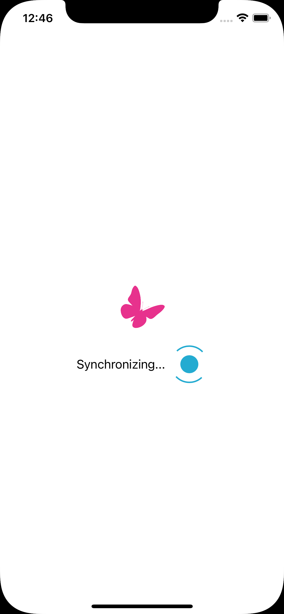
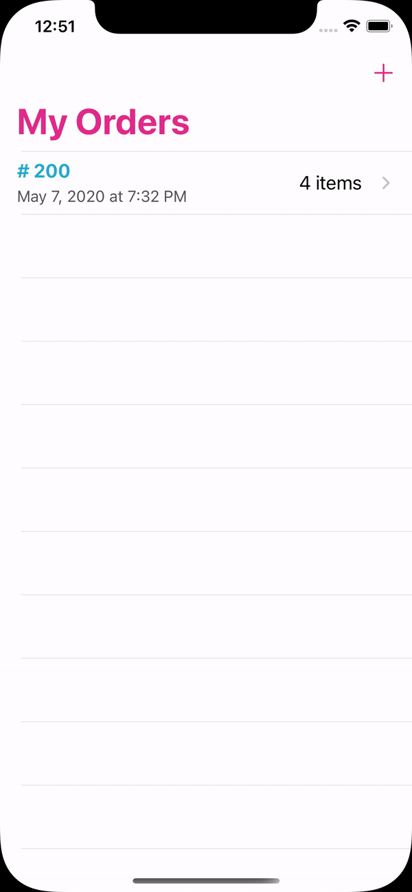
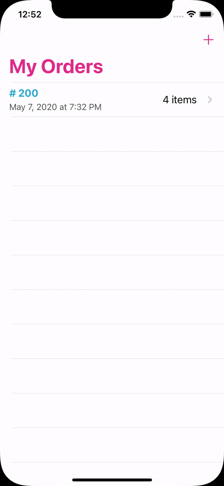
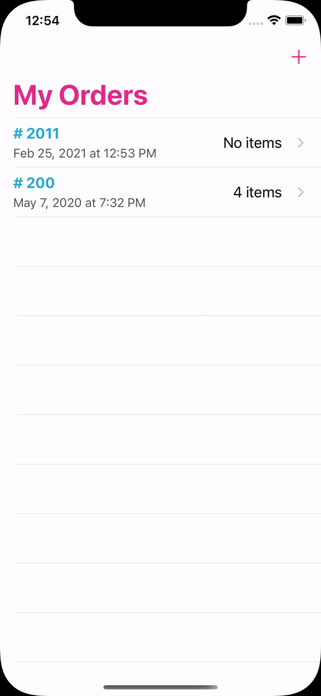

# Butterfly
A simple app showing a list of orders and a detail view for each on tap. It's possible to add new locally saved order or item.

    
    
    

## Preview

    
    
    
    

## Usage

To run the app, it is simple

1. Download and extract the zip
2. Open the workspace with xcode
    - No need to run **\"pod install\"**
    - The `pod` diectory is tracked
3. `cmd+Shift+K` to clean then `cmd+R` to run

## Requirement

- Swift 5.3
- iOS 11.0 and above

## Design pattern

This app uses the classic Apple's MVC pattern.

## Discussion

- The synchronization of the local data with the server occurs each time the app is launched. Also you can do it manually with the "Pull to refresh" feature in the home screen.

- I assumed that if any sub entity of `Purchase Order` has been updated the `last update date` of the order itself would be updated as well. That's how i detect if an order has been updated. Regarding the way the refresh data `func` has been coded this behavior can easily be changed to check each sub entity even if the order hasn't been updated.

- After adding a new `order` the list of the orders is reloaded from `core data` and the hole `tableView` is reloaded. This behavior could be easily be changed to only add the new `order` to the list. A choice has to be done between these two options regarding the performance vs security.

- A basic form validation has been integrated assuming the following
    + The `Order number` is composed only from digits
    + The `Order number` is unique
    + The `Item product ID` is composed only from digits

- The app is Dark Mode compatible

- The app is localized and supports both English and French.